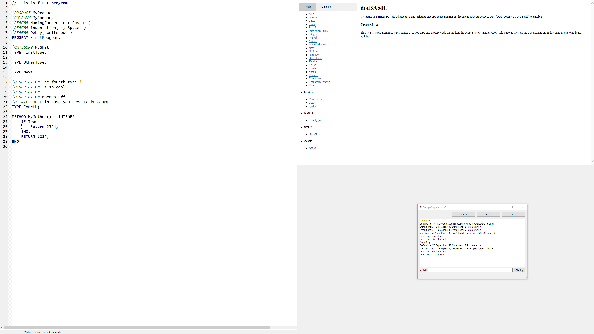

# UnityBasic

A fun hack project to write a Basic IDE that (hot) compiles to a Unity project. Pushed it for a week to see how far I can go but didn't really reach the point of running a minimal version running end-to-end.

Written in [PureBasic](https://www.purebasic.com).

